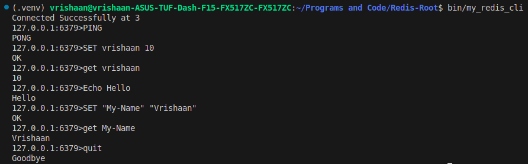

# 🚀 Redis CLI Client (RESP2 Protocol)

A custom-built Redis command-line interface (CLI) client implemented in C++ using low-level socket programming.  

Supports the RESP2 (REdis Serialization Protocol) and provides an interactive REPL for real-time Redis command execution.

------------------------------------------------------

## 🧠 Features

- 📡 Connects to Redis server via TCP (IPv4/IPv6)
  
- 🧱 RESP2 command serialization and response parsing
  
- 💬 Interactive REPL interface

- ⚙️ Command-line arguments for host and port
  
- 🧪 Supports one-shot and interactive commands
  
- 🧼 Clean, modular OOP structure

------------------------------------------------------

## 📁 Project Structure

Redis-Client/

│

├── include/

│ ├── CLI.h

│ ├── RedisClient.h

│ ├── CommandHandler.h

│ └── ResponseParser.h

│

├── src/ 

│ ├── CLI.cpp

│ ├── RedisClient.cpp

│ ├── CommandHandler.cpp

│ └── ResponseParser.cpp

│

├── bin/

│

├── build/

│

└── Makefile

------------------------------------------------------

## ✍️Project Demo

------------------------------------------------------

## ⚙️ Command Line Option

      Option        | Description          | Default
       -h'          | Redis server address | 127.0.0.1 
      `-p`          | Redis port number    | 6379      

------------------------------------------------------

## 📚Protocol Referecnce

Uses RESP2 protocol for encoding commands and parsing responses

Supports all common Redis types:

        +OK,  
        
        -ERR, 
        
        :123, 
        
        $5\r\nhello, 
        
        *2\r\n$3\r\nfoo\r\n$3\r\nbar

-----------------------------------------------------

## 💡 Future Work

  Add support for RESP3
  
  Auto-complete in REPL
  
  Color-coded output
  
  TLS/SSL support

## 🙏 Acknowledgements

This project was inspired and guided by [Dev w/Sel](https://www.youtube.com/watch?v=Z3jtQyj88S0&list=PL6F3pyVdiAkcgvk8Zn4_GKDk9ClGjzNEP).  
Much of the structure and approach follows their excellent explanation. Thank you!

> ❗Note: This project was not originally designed by me. It was built entirely by following a tutorial, with the purpose of learning and reviewing the internal logic of Redis communication.

I am now working on understanding each component fully, and I plan to make meaningful changes (e.g., adding RESP3, logging, etc.) as I grow.
